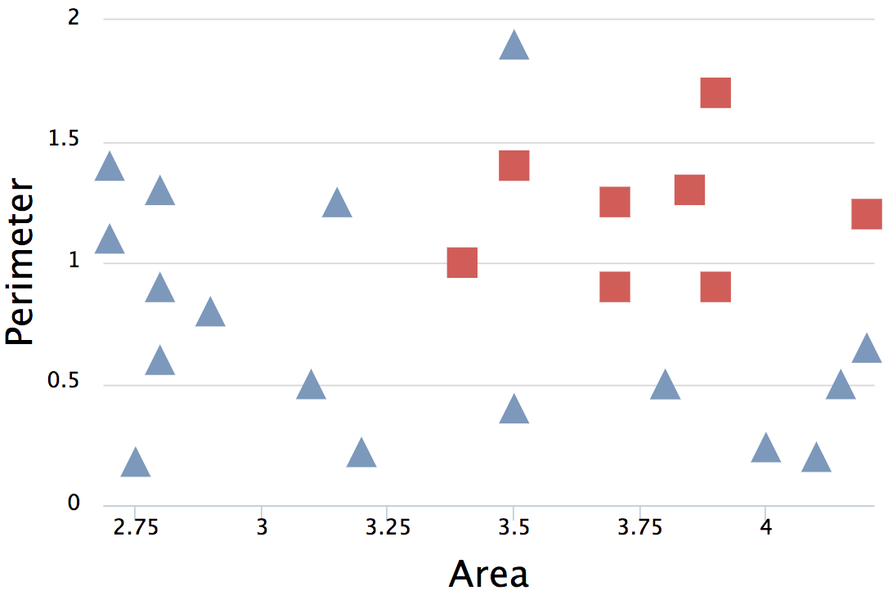
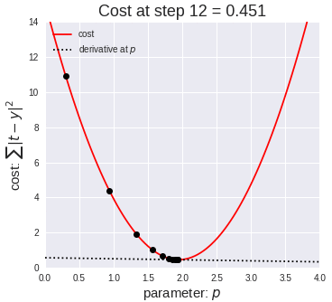
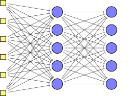

<!-- .slide: data-background="images/network-background.jpg" class="background" -->

<h2>The Institute for Ethical AI & ML</h2>
<h4>The ML Ecosystem and its gobal economic impact</h4>

   
   
    Alejandro Saucedo   
    <a href="http://twitter.com/AxSaucedo">@AxSaucedo</a> 
    <a href="http://linkedin.com/in/AxSaucedo">in/axsaucedo</a> 
   

[NEXT]
<!-- .slide: data-background="images/network-background.jpg" class="background" -->

<h2>The Institute for Ethical AI & ML</h2>
<h4>The ML Ecosystem and its gobal economic impact</h4>

<table class="bio-table">
  <tr>
    <td style="float: left">
        
         
        Alejandro Saucedo
         
         
    </td>
    <td style="float: left; color: white; font-size: 0.7em;">

         
        Head of Deployed Engineering
         
        <a style="color: cyan" href="http://eigentech.com">Eigen Technologies</a>
         
         
        Chairman
         
        <a style="color: cyan" href="http://ethical.institute">The Institute for Ethical AI & ML</a>
         
         
        Fellow (AI, Data & ML)
         
        <a style="color: cyan" href="#">The RSA</a>
         
         
        Advisor
         
        <a style="color: cyan" href="http://teensinai.com">TeensInAI.com Initiative</a>
         

    </td>
  </tr>
  <tr>
  </tr>
</table>

[NEXT]
<!-- .slide: data-background="images/network-background.jpg" class="background smallquote" -->

## Global Economic Impacts of ML

> The Institute & the Ethical ML Pledge
>  
>  
> Intuition on Machine Learning
>
> Dimensions of ML category segmentation
> 
> Key issues, risks and opportunities

#### Followed by a deep dive discussion

[NEXT]

# #LetsDoThis

[NEXT SECTION]
# 1. The Institute for Ethical AI & ML

[NEXT]
## Vision
Our vision is to attain conscious human-driven AGI

## Mission
To become the platform that empowers technology leaders through
industry frameworks that ensure the long-term ethical development of AI

[NEXT]
## Advisors & Ethical ML Committee

* Lucy Yu, Policy Director at Five.AI
* Tom Ewing, Principal Data Scientist at UK DfT
* Waleed Khouri, Senior Manager at Amazon
* Adam Kosiorek, Researcher at U. of Oxford & DeepMind
* Parikshat Singh, CEO at The Engineering Company

[NEXT]

## IEML phased rollout plan
* **Phase 1 - Ethical ML by pledge**
    * Commit as a technology leader  
* **Phase 2 - Ethical ML by process**
    * Implement the internal processes to your workplace  
* **Phase 3 - Ethical ML by certification**
    * Obtain the certifications required  
* **Phase 4 - Ethical ML by regulation**
    * Implement policy based on case-studies

[NEXT]
# Why is it important?

 
### Let's find out what ML IS 
### and what ML is NOT

[NEXT SECTION]

# 2. Intuition on AI & Machine Learning

[NEXT]

### What you've heard:

* AI is going to take your job
* It's going to create a new job for you
* AI is outsmarting all humans
* Machine learning, deep learning...
* It's going to kill us all

[NEXT]

### What really is AI

The general label for a field of study, specifically
the study of whatever might answer the question of 
"What is required for a machine to exhibit intelligence"

[NEXT]

### There 2 main approaches to building "AI" systems:

* Hard coding the rules (such as what you'd do in complex excel formulas)

or

* Building systems that can "learn the rules" by learning from examples

[NEXT]

### The "AI" most people refer to

The main sub-field that currently people refer to when they
talk about AI is the latter - **Machine Learning**.

[NEXT]

But machine learning has been there for a long time...

### Then why the hype now?

[NEXT]

## Deep Learning

A branch of Machine Learning that has allowed engineers
and data scientists build systems that learn from data

#### Very very large amounts of data!

[NEXT]

## In essence, all Machine Learning is:

If give you an example, would you be able to learn the answers?

[NEXT]
Given some input data, predict the correct output

Let's try to build a system to predict whether a shape is a square or a triangle

### How do we do this?

[NEXT]
## First, let's visualise it

* Imagine a 2-d plot
* The x-axis is the area of the input shape
* The y-axis is the perimeter of the input shape

[NEXT]
## We want to find a division line

 

The line defined by function
 
 
**$f(x̄) = mx̄ + b$**, where:
 
 
**x̄** is input (area & perimeter) </li>
 
 
**m** and **b** are weights/bias
 

[NEXT]
## We want to find a division line

 

The result **$f(x̄)$** states whether it's a triangle or square
 
 
(e.g. if it's larger than 0.5 it's triangle otherwise square)

 
 

[NEXT]

So now let's start with a blank brain

[  ]

The machine knows nothing yet...

[NEXT]
Now let's take some data examples

And let the machine do the learning

[NEXT]
### We let the machine do the learning

We give it two examples (one square, one triangle)

And it tries to create a line

[NEXT]
### We let the machine do the learning

We give it more examples

[NEXT]
### We let the machine do the learning

and more...

[NEXT]
### Minimising loss function

We optimise the model by **minimising its loss**.

Keep adjusting the weights...

...until loss is not getting any smaller.

[NEXT]
### Finding the weights!

When it finishes, we find optimised weights and biases

i.e. **$f(x̄)$ = triangle  if ($0.3 x̄ + 10$) > 0.5 else square**

[NEXT]
### Now predict new data

We now have a system that "knows" how to differentiate triangles from squares

[NEXT]
#### But triangles and squares are boring...

[NEXT]
What do we do when we have more complex cases?

...way more complex!

[NEXT]

We just need more flexible models...

...and more data...

### Much more data!

[NEXT]

### Neural networks!

Remember our function `f(x) = mx + b`

This is the same function for a neuron (perceptron)

[NEXT]
### Instead of just one neuron

[NEXT]
### We just have many

This gives the function more flexibility

[NEXT]
### With a few layers

This gives more flexibility for learning

[NEXT]
#### But this technology has been out there for decades!

## Why the hype now?

[NEXT]
#### A breakthrough in machine learning called

# backpropagation

[NEXT]

Which allowed for neural networks to be MUCH deeper

#### and hence learn from tons of more data

which allows to learn more complex things

[NEXT]
### Deep Networks &mdash; many hidden layers

[NEXT]

[NEXT]

[NEXT]

[NEXT]

[NEXT]

# Congratulations

You are now an expert on Machine Learning!

[NEXT SECTION]

# 3. AI impact on sectors

[NEXT]

# Overview

Analysis of applications, players and impact of ML across sectors

Followed by a case study

[NEXT]

Core ML Applications

* Real time optimisation / Predictive analytics
* Strategic optimisation / Forecasting
* Radical personalisation
* Data analysis from (real) big data
* Automation of operational processes
* Anomality detection
* Information retrieval
* Unstructured data processing

[NEXT]

Sectors:

| | | | |
| - | - | - | - |
| Automotive | Manufacturing | Consumer | Defense |
| Agriculture | Energy | Healthcare | Pharma | 
| Public | Media | Telecom | Transport |
| Education | Legal | Programming | Construction | 
| Space | Finance | Security | | 
| | | | |

[NEXT]

Sectors covered today:

| | | | |
| - | - | - | - |
| Manufacturing | Defense | Agriculture | Healthcare/Pharma |
| Politics | Transport | Education | Finance | 
| | | | |

 
(Case study will contain Legal)

[NEXT]

Assessment of impact in sector

* Availability of data
* Ripeness for disruption

[NEXT]
# Opportunities
* Predict failure and recommend proactive maintenance for equipment
* Optimize complex manufacturing processes in real time
* Predict future demand trends in supply chain
* Identify design problems in pre-production to reduce ramp-up time

[NEXT]
# Agriculture 

_note_
* Optimise growth techniques with reinforcement learning
* Optimise pricing in real time based on future market, weather, etc
* Predict yield for farming or production leveraging data
* Predict demand trends for production decisions
* Automate produciton vehicles

[NEXT]
# Healthcare / Pharma
_note_
* Automatic disease detection from sources across the body
* Continuous monitoring of health for personalised prevention
* Triage patient cases during hospital admission using patient data
* Optimise design of clinical trials, including label writing/patient selection
* Reduce experiments (ie animal testing) through big data analysis
* Identify targeted patient sub-groups that are underserved
* Reduce cost and time to market for developing medicine

[NEXT]
# Politics
_note_
* Predict risk of ilicit activity or terrorism using historical crime data and other statistics
* Optimize public policy opinions by taking into account greater set of complex interactions
* Personalise public services to target individual citizens based on multi-modal data
* Optimize procurement strategy to reduce costs for large government agencies (e.g. defense)
* Optimise labor and budget allocation for publicly provided services
* Monitor and automate processes in public prisons to reduce costs

[NEXT]
# Transport 
_note_
* Optimise pricing and scheduling based on real-time demand updates (e.g. airlines, trucking, etc)
* Predict failure and recommend proactive maintenance for vehicles
* Enable autonomous road/flying vehicles to become commodatised within cities
* Open the possibility for intelligent infrastructure communicating with autonomous vehicles and trains
* Automate operational processes of loading, driving, checking, etc. vehicles

[NEXT]
# Education 
_note_
* Automation of operational tasks for teachers, staff and even parents
* Personalised education methods optimising individual learning preferences 
* Drastically increase the amount of information taught in less time
* Educational material is restructured to optimise for long-term performance
* Tutoring will be replaced with chatbots and intelligent systems

[NEXT]
# Defense 
_note_
* Complex systems to enhance and counteract autonomous drones
* Intelligent automated online warfare will increase drastically
* Smart weapons will enable super-human skills in battle-field (auto-aiming, robotic extensions, etc)
* Increase psychological warfare via new communication mediums
* Strategic prediction advice when making decisions

[NEXT]
# Finance

_note_
* Identify fraudulent activity using customer transactions and other relevant data
* Evaluate customer credit risk using large amounts of data
* Predit more accurate price movements based on greater amount of data
* Automate regulatory exercises by gathering and analysing structure data

[NEXT]
## [Demo](http://localhost:8080)

<iframe style="height: 100%; width: 100%;" src="http://localhost:8080/">
</iframe>

[NEXT]

## Implications
* Automation of processes and people
* New generation cybersecurity (talk 21st)
* New national threats (both planned and accidental)
* Reduction of cost, increased efficiency = Jevons paradox?
 

[NEXT]

## Jevons Paradox

In 1865, William Jevons described:

Machines that were using coal for fuel became more efficient

They needed less coal to complete a given task

Because machines were more cost effective they were before

their use became more widespread and demand rised

despite each machine requiring less coal to operate

the total amount of coal required to power machines is greater and not less

[NEXT]

### But is this still valid?

Yes, we have seen this with electricity

But also with mobile phones, cars, computers, TVs, etc.

[NEXT SECTION]

# 4. The disrupting players

[NEXT SECTION]

# 5. The Impact of AI

[NEXT SECTION]

<!-- .slide: data-background="images/network-background.jpg" class="background smallest" -->

### But for us?

> Obtained an intuitive understanding on ML
> 
> Learned about caveats on practical ML
> 
> Obtained tips on building distributed architectures
> 
> Got an taste of elastic DevOps infrastructure

[NEXT]
<!-- .slide: data-background="images/network-background.jpg" class="background" -->
### Code
https://github.com/axsauze/crypto-ml

### Slides
http://github.com/axsauze/industrial-machine-learning

[NEXT]
<!-- .slide: data-background="images/network-background.jpg" class="background" -->

<h2>Industrial Machine Learning</h2>

<table class="bio-table">
  <tr>
    <td style="float: left">
        
         
        Alejandro Saucedo
         
         
    </td>
    <td style="float: left; color: white; font-size: 0.7em;">

         
        Head of Deployed Engineering
         
        <a style="color: cyan" href="http://eigentech.com">Eigen Technologies</a>
         
         
        Chairman
         
        <a style="color: cyan" href="http://ethical.institute">The Institute for Ethical AI & ML</a>
         
         
        Fellow (AI, Data & ML)
         
        <a style="color: cyan" href="#">The RSA</a>
         
         
        Advisor
         
        <a style="color: cyan" href="http://teensinai.com">TeensInAI.com initiative</a>
         

    </td>
  </tr>
  <tr>
  </tr>
</table>

### <a style="color: cyan" href="#">Contact me at: a@e-x.io</a>

