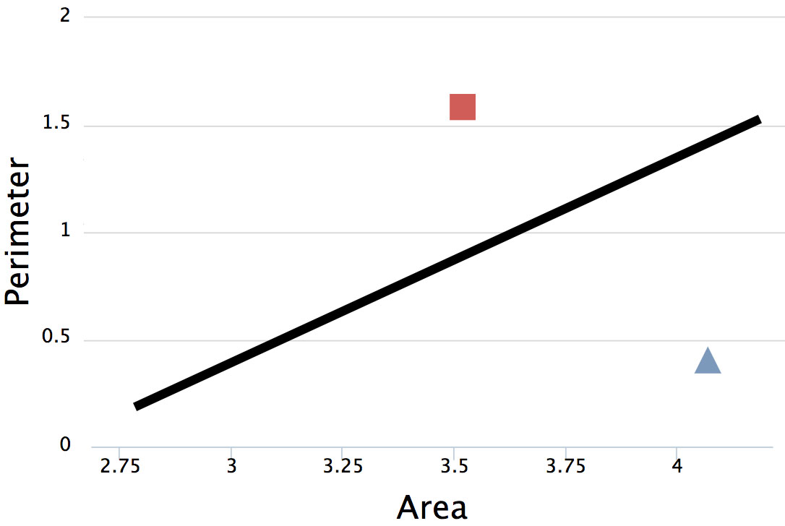

<!-- .slide: data-background="images/network-background.jpg" class="background" -->

<h2>The Institute for Ethical AI & ML</h2>
<h4>The ML Ecosystem and its impact in industry</h4>

   
   
    Alejandro Saucedo   
    <a href="http://twitter.com/AxSaucedo">@AxSaucedo</a> 
    <a href="http://linkedin.com/in/AxSaucedo">in/axsaucedo</a> 
   

[NEXT]
<!-- .slide: data-background="images/network-background.jpg" class="background" -->

<h2>The Institute for Ethical AI & ML</h2>
<h4>The ML Ecosystem and its impact in industry</h4>

<table class="bio-table">
  <tr>
    <td style="float: left">
        
         
        Alejandro Saucedo
         
         
    </td>
    <td style="float: left; color: white; font-size: 0.7em;">

         
        Head of Deployed Engineering
         
        <a style="color: cyan" href="http://eigentech.com">Eigen Technologies</a>
         
         
        Chairman
         
        <a style="color: cyan" href="http://ethical.institute">The Institute for Ethical AI & ML</a>
         
         
        Fellow (AI, Data & ML)
         
        <a style="color: cyan" href="#">The RSA</a>
         
         
        Advisor
         
        <a style="color: cyan" href="http://teensinai.com">TeensInAI.com Initiative</a>
         

    </td>
  </tr>
  <tr>
  </tr>
</table>

[NEXT]
<!-- .slide: data-background="images/network-background.jpg" class="background smallquote" -->

## Global Economic Impacts of ML

> The Institute & the Ethical ML Pledge
>  
>  
> Intuition on practial AI
>
> Applications & Impacts of AI in industry
> 
> Q&A & Deep Dive

#### Followed by a deep dive discussion

[NEXT]
<!-- .slide: data-background="images/particles.gif" class="background smallquote" -->

# #LetsDoThis

[NEXT SECTION]
<!-- .slide: data-background="images/parti.png" class="background smallquote" -->
# 1. The Institute for Ethical AI & ML

[NEXT]
<!-- .slide: data-background="images/parti.png" class="background smallquote" -->

#### Our vision is to drive conscious human-driven AGI
<iframe style="height: 50vh; width: 100vw" src="http://ethical.institute"></iframe>

[NEXT]
<!-- .slide: data-background="images/parti.png" class="background smallquote" -->

## Mission
To become the platform that empowers technology leaders through
industry frameworks that ensure the long-term ethical development of AI

[NEXT]
<!-- .slide: data-background="images/parti.png" class="background smallquote" style="color: white" -->
## Advisors & Ethical ML Committee

* Lucy Yu, Policy Director at Five.AI
* Tom Ewing, Principal Data Scientist at UK DfT
* Waleed Khouri, Senior Manager at Amazon
* Adam Kosiorek, Researcher at U. of Oxford & DeepMind
* Parikshat Singh, CEO at The Engineering Company

[NEXT]
<!-- .slide: data-background="images/parti.png" class="background smallquote" style="color: white" -->

## IEML phased rollout plan
* **Phase 1 - Ethical ML by pledge**
    * Commit as a technology leader  
* **Phase 2 - Ethical ML by process**
    * Implement the internal processes to your workplace  
* **Phase 3 - Ethical ML by certification**
    * Obtain the certifications required  
* **Phase 4 - Ethical ML by regulation**
    * Implement policy based on case-studies

[NEXT]
<!-- .slide: data-background="images/parti.png" class="background smallquote" style="color: white" -->

## 2018
* Q2 2018 - 1st round of signatories
* 25th June - ConstrucTech / PropTech with Landsec
* 7th August - Big launch: The EthicalML Pledge
* Fall 2018 - Start developing Level 2
* Q4 2018 - EthicalML Conference

 
## 2019
* Q1 2019 - EthicalML Industry/Sector Sessions
* Q4 2019 - Release of the Algorithmic Bias Standard

[NEXT]
# Why is it important?
<!-- .slide: data-background="images/parti.png" class="background smallquote" style="color: white" -->

 
### Let's find out what ML IS 
### and what ML is NOT

[NEXT SECTION]
<!-- .slide: data-background="images/partistat.png" class="background smallquote" style="color: white" -->

# 2. Intuition on AI & Machine Learning

[NEXT]
<!-- .slide: data-background="images/partistat.png" class="background smallquote" style="color: white" -->

## What you've heard:

* AI is going to take your job
* It's going to create a new job for you
* AI is outsmarting all humans
* Machine learning, deep learning...
* It's going to kill us all

[NEXT]
<!-- .slide: data-background="images/partistat.png" class="background smallquote" style="color: white" -->

## What really is AI

The general label for a field of study, specifically
the study of whatever might answer the question of 
"What is required for a machine to exhibit intelligence"

[NEXT]
<!-- .slide: data-background="images/partistat.png" class="background smallquote" style="color: white" -->

## There 2 main approaches to AI

* Hard coding the rules (such as what you'd do in complex excel formulas)

## or

* Building systems that can "learn the rules" by learning from examples

[NEXT]
<!-- .slide: data-background="images/partistat.png" class="background smallquote" style="color: white" -->

## The "AI" most people refer to

The main sub-field that currently people refer to when they
talk about AI is the latter - **Machine Learning**

[NEXT]
<!-- .slide: data-background="images/partistat.png" class="background smallquote" style="color: white" -->

But machine learning has been there for a long time...

## Then why the hype now?

[NEXT]
<!-- .slide: data-background="images/partistat.png" class="background smallquote" style="color: white" -->

## Deep Learning

A branch of Machine Learning that has allowed engineers
and data scientists build systems that learn from data

#### Very very large amounts of data! 

[NEXT]
<!-- .slide: data-background="images/partistat.png" class="background smallquote" style="color: white" -->

## In essence, all Machine Learning is:

If give you an example, would you be able to learn the answers?

[NEXT]
<!-- .slide: data-background="images/partistat.png" class="background smallquote" style="color: white" -->
Given some input data, predict the correct output

Let's try to build a system to predict whether a shape is a square or a triangle

## How do we do this?

[NEXT]
<!-- .slide: data-background="images/partistat.png" class="background smallquote" style="color: white" -->
## First, let's visualise it

* Imagine a 2-d plot
* The x-axis is the area of the input shape
* The y-axis is the perimeter of the input shape

[NEXT]
<!-- .slide: data-transition="slide-in fade-out" data-background="images/partistat.png" class="background smallquote" style="color: white" -->
## We want to find a division line

 

The line defined by function
 
 
**$f(x̄) = mx̄ + b$**, where:
 
 
**x̄** is input (area & perimeter) </li>
 
 
**m** and **b** are weights/bias
 

[NEXT]
<!-- .slide: data-transition="fade-in slide-out" data-background="images/partistat.png" class="background smallquote" style="color: white" -->
## So we can predict new data

 

The result **$f(x̄)$** states whether it's a triangle or square
 
 
(e.g. if it's larger than 0.5 it's triangle otherwise square)

 
 

[NEXT]
<!-- .slide: data-background="images/partistat.png" class="background smallquote" style="color: white" -->

So now let's start with a blank brain

[  ]

The machine knows nothing yet...

[NEXT]
<!-- .slide: data-background="images/partistat.png" class="background smallquote" style="color: white" -->
Now let's take some data examples

And let the machine do the learning

[NEXT]
<!-- .slide: data-transition="slide-in fade-out" data-background="images/partistat.png" class="background smallquote" style="color: white" -->
## The machine does the learning

We give it two examples (one square, one triangle)

[NEXT]
<!-- .slide: data-transition="fade-in" data-background="images/partistat.png" class="background smallquote" style="color: white" -->
## The machine does the learning

We give it more examples

[NEXT]
<!-- .slide:data-transition="fade-in slide-out" data-background="images/partistat.png" class="background smallquote" style="color: white" -->
## The machine does the learning

and more...

[NEXT]
<!-- .slide: data-background="images/partistat.png" class="background smallquote" style="color: white" -->
## Minimising loss function

We optimise the model by **minimising its loss**.

Keep adjusting the weights...

...until loss is not getting any smaller.

[NEXT]
<!-- .slide: data-background="images/partistat.png" class="background smallquote" style="color: white" -->
## Finding the weights!

When it finishes, we find optimised weights and biases

i.e. **$f(x̄)$ = triangle  if ($0.3 x̄ + 10$) > 0.5 else square**

[NEXT]
<!-- .slide: data-background="images/partistat.png" class="background smallquote" style="color: white" -->
## Now predict new data

We now have a system that "knows" how to differentiate triangles from squares

[NEXT]
<!-- .slide: data-background="images/partistat.png" class="background smallquote" style="color: white" -->
### But triangles and squares are boring...

[NEXT]
<!-- .slide: data-background="images/partistat.png" class="background smallquote" style="color: white" -->
What do we do when we have more complex cases?

...way more complex!

[NEXT]
<!-- .slide: data-background="images/partistat.png" class="background smallquote" style="color: white" -->

We just need more flexible models...

...and more data...

### Much more data!

[NEXT]
<!-- .slide: data-background="images/partistat.png" class="background smallquote" style="color: white" -->

### Neural networks!

Remember our function `f(x) = mx + b`

This is the same function for a neuron (perceptron)

[NEXT]
<!-- .slide: data-background="images/partistat.png" class="background smallquote" style="color: white" -->
### Instead of just one neuron

[NEXT]
<!-- .slide: data-background="images/partistat.png" class="background smallquote" style="color: white" -->
### We just have many

This gives the function more flexibility

[NEXT]
<!-- .slide: data-background="images/partistat.png" class="background smallquote" style="color: white" -->
### With a few layers

This gives more flexibility for learning

[NEXT]
<!-- .slide: data-background="images/partistat.png" class="background smallquote" style="color: white" -->
#### But this technology has been out there for decades!

## Why the hype now?

[NEXT]
<!-- .slide: data-background="images/partistat.png" class="background smallquote" style="color: white" -->
#### A breakthrough in machine learning called

# backpropagation

[NEXT]
<!-- .slide: data-background="images/partistat.png" class="background smallquote" style="color: white" -->

Which allowed for neural networks to be MUCH deeper

#### and hence learn from tons of more data

which allows to learn more complex things

[NEXT]
<!-- .slide: data-background="images/partistat.png" class="background smallquote" style="color: white" -->
### Deep Networks &mdash; many hidden layers

[NEXT]
<!-- .slide: data-transition="slide-in fade-out" data-background="images/partistat.png" class="background smallquote" style="color: white" -->

[NEXT]
<!-- .slide: data-transition="fade-in" data-background="images/partistat.png" class="background smallquote" style="color: white" -->

[NEXT]
<!-- .slide: data-transition="fade-in" data-background="images/partistat.png" class="background smallquote" style="color: white" -->

[NEXT]
<!-- .slide: data-transition="fade-in slide-out" data-background="images/partistat.png" class="background smallquote" style="color: white" -->

[NEXT]
<!-- .slide: data-background="images/partistat.png" class="background smallquote" style="color: white" -->

# Congratulations

You are now an expert on Machine Learning!

### Let's recap...

[NEXT]
<!-- .slide: data-background="images/partistat.png" class="background smallquote" style="color: white" -->

### Let's recap...

* The most popular branch of AI is machine learning
* Machine learning allows algorithms to learn from data
* Learning from large datasets allows complex practical use
* Deep learning is a popular method for scale learning

[NEXT]
<!-- .slide: data-background="images/partistat.png" class="background smallquote" style="color: white" -->

 
### And...
* These methods have been commoditised
* Computing power has become exponentially cheaper
* The popularity, research and competition is booming

[NEXT SECTION]
<!-- .slide: data-background="images/space.jpg" class="background smallquote" style="color: white" -->

# 3. Applications in sectors

[NEXT]
<!-- .slide: data-background="images/space.jpg" class="background smallquote" style="color: white" -->

# Overview

Analysis of applications, players and impact of ML across sectors

Followed by a case study

[NEXT]
<!-- .slide: data-background="images/space.jpg" class="background smallquote" style="color: white" -->

## Core ML Applications

* Real time optimisation / Predictive analytics
* Strategic optimisation / Forecasting
* Radical personalisation
* Data analysis from (real) big data
* Automation of operational processes
* Anomality detection
* Information retrieval
* Unstructured data processing

[NEXT]
<!-- .slide: data-background="images/space.jpg" class="background smallquote" style="color: white" -->

## Sectors:

| | | | |
| - | - | - | - |
| Automotive | Manufacturing | Consumer | Defense |
| Agriculture | Energy | Healthcare | Pharma | 
| Public | Media | Telecom | Transport |
| Education | Legal | Programming | Construction | 
| Space | Finance | Security | | 
| | | | |

[NEXT]
<!-- .slide: data-background="images/space.jpg" class="background smallquote" style="color: white" -->

## Sectors covered today:

| | | | |
| - | - | - | - |
| Manufacturing | Defense | Agriculture | Healthcare/Pharma |
| Politics | Transport | Education | Finance | 
| | | | |

 
(Case study be a demo on finance)

[NEXT]
<!-- .slide: data-background="images/space.jpg" class="background smallquote" style="color: white" -->

Assessment of impact in sector

* Availability of data
* Ripeness for disruption

[NEXT]
<!-- .slide: data-background="images/space.jpg" class="background smallquote" style="color: white" -->

# Opportunities
* Predict failure and recommend proactive maintenance for equipment
* Optimize complex manufacturing processes in real time
* Predict future demand trends in supply chain
* Identify design problems in pre-production to reduce ramp-up time

[NEXT]
<!-- .slide: data-background="images/space.jpg" class="background smallquote" style="color: white" -->

# Agriculture 

_note_
* Optimise growth techniques with reinforcement learning
* Optimise pricing in real time based on future market, weather, etc
* Predict yield for farming or production leveraging data
* Predict demand trends for production decisions
* Automate produciton vehicles

[NEXT]
<!-- .slide: data-background="images/space.jpg" class="background smallquote" style="color: white" -->

# Healthcare / Pharma
_note_
* Automatic disease detection from sources across the body
* Continuous monitoring of health for personalised prevention
* Triage patient cases during hospital admission using patient data
* Optimise design of clinical trials, including label writing/patient selection
* Reduce experiments (ie animal testing) through big data analysis
* Identify targeted patient sub-groups that are underserved
* Reduce cost and time to market for developing medicine

[NEXT]
<!-- .slide: data-background="images/space.jpg" class="background smallquote" style="color: white" -->

# Politics
_note_
* Predict risk of ilicit activity or terrorism using historical crime data and other statistics
* Optimize public policy opinions by taking into account greater set of complex interactions
* Personalise public services to target individual citizens based on multi-modal data
* Optimize procurement strategy to reduce costs for large government agencies (e.g. defense)
* Optimise labor and budget allocation for publicly provided services
* Monitor and automate processes in public prisons to reduce costs

[NEXT]
<!-- .slide: data-background="images/space.jpg" class="background smallquote" style="color: white" -->

# Transport 
_note_
* Optimise pricing and scheduling based on real-time demand updates (e.g. airlines, trucking, etc)
* Predict failure and recommend proactive maintenance for vehicles
* Enable autonomous road/flying vehicles to become commodatised within cities
* Open the possibility for intelligent infrastructure communicating with autonomous vehicles and trains
* Automate operational processes of loading, driving, checking, etc. vehicles

[NEXT]
<!-- .slide: data-background="images/space.jpg" class="background smallquote" style="color: white" -->

# Education 
_note_
* Automation of operational tasks for teachers, staff and even parents
* Personalised education methods optimising individual learning preferences 
* Drastically increase the amount of information taught in less time
* Educational material is restructured to optimise for long-term performance
* Tutoring will be replaced with chatbots and intelligent systems

[NEXT]
<!-- .slide: data-background="images/space.jpg" class="background smallquote" style="color: white" -->

# Defense 
_note_
* Complex systems to enhance and counteract autonomous drones
* Intelligent automated online warfare will increase drastically
* Smart weapons will enable super-human skills in battle-field (auto-aiming, robotic extensions, etc)
* Increase psychological warfare via new communication mediums
* Strategic prediction advice when making decisions

[NEXT]
<!-- .slide: data-background="images/space.jpg" class="background smallquote" style="color: white" -->

# Finance

_note_
* Identify fraudulent activity using customer transactions and other relevant data
* Evaluate customer credit risk using large amounts of data
* Predit more accurate price movements based on greater amount of data
* Automate regulatory exercises by gathering and analysing structure data

[NEXT]
<!-- .slide: data-background="images/space.jpg" class="background smallquote" style="color: white" -->

## [Demo](http://lewis.eigen.tech)

<iframe style="height: 100%; width: 100%;" src="http://localhost:8080/">
</iframe>

[NEXT]
<!-- .slide: data-background="images/space.jpg" class="background smallquote" style="color: white" -->

A lot of this sounds good, but

#### how's it going to affect the world?

[NEXT SECTION]
<!-- .slide: data-background="images/spaceline.jpg" class="background smallquote" style="color: white" -->

# 4. AI impact in industry

[NEXT]
<!-- .slide: data-background="images/spaceline.jpg" class="background smallquote" style="color: white" -->

# Implications
* Real time optimisation / Predictive analytics
* Strategic optimisation / Forecasting
* Radical personalisation
* Data analysis from (real) big data
* Automation of operational processes
* Anomality detection
* Information retrieval
* Unstructured data processing

[NEXT]
<!-- .slide: data-background="images/spaceline.jpg" class="background smallquote" style="color: white" -->
# Implications
* Automation of processes and people
* New generation cybersecurity (talk 21st)
* New unsuspected national threats 
* Danger of algorithmic bias (beyond human traits)
* Disasters due to lack (and misunderstanding) of regulation
* Dangers of "staying behind" in the AI race
* Increased efficiency, reduction of cost

[NEXT]
<!-- .slide: data-background="images/spaceline.jpg" class="background smallquote" style="color: white" -->

## Jevons Paradox

_note_
In 1865, William Jevons described:

Machines that were using coal for fuel became more efficient

They needed less coal to complete a given task

Because machines were more cost effective they were before

their use became more widespread and demand rised

despite each machine requiring less coal to operate

the total amount of coal required to power machines is greater and not less

[NEXT]
<!-- .slide: data-background="images/spaceline.jpg" class="background smallquote" style="color: white" -->

### But is this still valid?

Yes, we have seen this with electricity

But also with mobile phones, cars, computers, TVs, etc.

[NEXT]
<!-- .slide: data-background="images/spaceline.jpg" class="background smallquote" style="color: white" -->

“Artificial intelligence is the future, not only for us, but for all of humankind. It comes with colossal opportunities, but also threats that are difficult to predict. Whoever becomes the leader in this sphere will become the ruler of the world.”

 
### Can you guess who's quote is this?
 

[NEXT SECTION]
<!-- .slide: data-background="images/network-background.jpg" class="background smallest" style="color: white" -->
# 5. Deep Dive Discussion

[NEXT]
<!-- .slide: data-background="images/network-background.jpg" class="background smallest" style="color: white" -->
### Proposed agenda
* Deep dive on questions
* Run AI industry analysis process
* Next steps

[NEXT]
<!-- .slide: data-background="images/network-background.jpg" class="background smallest" style="color: white" -->

### Deep dive discussion
* Select one of the AI applications
* Pick an industry
* Let's deep dive on economic dangers
* Find out key actions that could be taken

[NEXT]
<!-- .slide: data-background="images/network-background.jpg" class="background" -->
### Code
https://github.com/axsauze/machine-learning-global

### Slides
https://axsauze.github.io/machine-learning-global/index.html#/

[NEXT]
<!-- .slide: data-background="images/network-background.jpg" class="background" -->

<h2>The Institute for Ethical AI & ML</h2>

<h4>The ML ecosystem and its impact in industry</h4>

<table class="bio-table">
  <tr>
    <td style="float: left">
        
         
        Alejandro Saucedo
         
         
    </td>
    <td style="float: left; color: white; font-size: 0.7em;">

         
        Head of Deployed Engineering
         
        <a style="color: cyan" href="http://eigentech.com">Eigen Technologies</a>
         
         
        Chairman
         
        <a style="color: cyan" href="http://ethical.institute">The Institute for Ethical AI & ML</a>
         
         
        Fellow (AI, Data & ML)
         
        <a style="color: cyan" href="#">The RSA</a>
         
         
        Advisor
         
        <a style="color: cyan" href="http://teensinai.com">TeensInAI.com initiative</a>
         

    </td>
  </tr>
  <tr>
  </tr>
</table>

